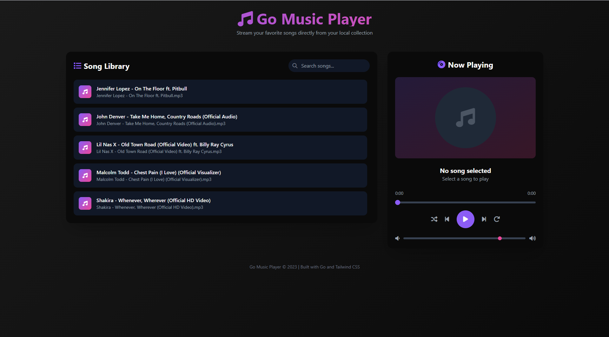
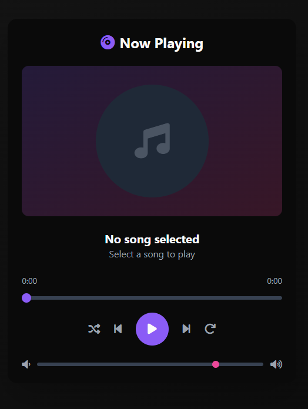
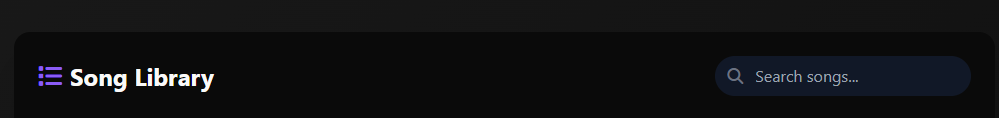

# 🎵 Go Music Player

A modern, professional web-based music player built with Go and enhanced with Tailwind CSS that allows users to play songs from a local folder.


<p align="center">
  
</p>

## 🚀 Features

- Serve MP3 files from a "songs/" folder
- Provides a `/songs` endpoint returning available songs as JSON
- Streams audio files through `/song/{filename}` endpoint
- Modern UI with Tailwind CSS styling
- Responsive design that works on mobile and desktop
- Full playback controls (play, pause, next, previous, shuffle, repeat)
- Progress bar with seeking capability
- Volume control
- Search functionality
- Visual feedback for currently playing song

## 🏗️ Tech Stack

- **Backend**: Go (standard library `net/http`)
- **Frontend**: HTML + JavaScript + Tailwind CSS
- **File Storage**: Local `songs/` folder
- **UI Library**: Tailwind CSS with Font Awesome icons

## 📁 Project Structure

```
music-player/
├── main.go
├── songs/ (place your MP3 files here)
├── static/
│   └── index.html
├── screenshots/
│   ├── dashboard.png
│   ├── player.png
│   └── playback_bar.png
└── README.md
```


## ▶️ Getting Started

1. **Place your music files**:
   - Add your MP3/WAV/OGG/FLAC files to the `songs/` folder
   - **Note**: For version control efficiency, this repository doesn't include actual music files
   - You can add your own music files or use the sample files provided in releases

2. **Run the server**:
   ```bash
   go run main.go
   ```

3. **Access the player**:
   - Open your browser and navigate to `http://localhost:8080`

## 🎵 Adding Music Files

### Option 1: Add Your Own Music
1. Copy your MP3/WAV/OGG/FLAC files to the `songs/` directory
2. Supported formats:
   - MP3 (.mp3)
   - WAV (.wav)
   - OGG (.ogg)
   - FLAC (.flac)
3. Refresh the player interface to see your songs

### Option 2: Use Sample Files
Sample music files are available in the [Releases](https://github.com/Kalpavruksha/go-music-player/releases) section of this repository.
Download and extract them to the `songs/` directory.

### Option 3: Create Test Files
You can create small test files for development:
```bash
# Create a 10-second silent MP3 for testing (requires ffmpeg)
ffmpeg -f lavfi -i anullsrc=r=44100:cl=mono -t 10 -q:a 9 -acodec libmp3lame songs/test.mp3
```

## 🎯 Usage

1. The player will automatically scan the `songs/` folder for audio files
2. All supported audio files will be displayed in the library
3. Use the search bar to filter songs
4. Click any song to play it
5. Use the playback controls at the bottom:
   - Previous/Next buttons
   - Play/Pause button
   - Shuffle and Repeat toggles
   - Progress bar for seeking
   - Volume slider

## 🔧 Supported Audio Formats

- MP3 (.mp3)
- WAV (.wav)
- OGG (.ogg)
- FLAC (.flac)

## 🖼️ Screenshots

### 🎛️ Main Dashboard
Browse your entire music library with a clean, modern interface.

<p align="center">
  
</p>

### 🎧 Music Player Interface
Full playback controls with album art placeholder and song information.

<p align="center">
  
</p>

### 🎚️ Playback Control Bar
Fixed-position playback bar with all essential controls.

<p align="center">
  
</p>

## 🔒 Security

The application includes basic security measures:
- Directory traversal protection
- File extension validation
- Safe file path handling

## 🛠️ Endpoints

- `GET /` - Serve the main player interface
- `GET /songs` - Returns JSON list of available songs
- `GET /song/{filename}` - Streams the requested audio file

## 🎨 UI Features

The modern UI includes:

- **Dark theme** - Easy on the eyes for extended listening sessions
- **Gradient accents** - Purple/pink color scheme for a musical feel
- **Responsive design** - Works on mobile, tablet, and desktop
- **Animated elements** - Smooth transitions and hover effects
- **Visual feedback** - Currently playing song is highlighted
- **Album art placeholder** - Space for future album art integration
- **Full playback controls** - Professional-grade player interface

## 🚀 Advanced Features Roadmap

This basic player can be enhanced with professional features:

### 🎵 Playlists & Libraries
- User-created playlists with drag-and-drop organization
- Auto-generated playlists (Top 10 most played, Recently Added)
- Smart playlist based on genres, moods, or activities

### 🔊 Audio Enhancement
- Real-time equalizer with bass/treble adjustment
- Audio visualizer with waveform display
- Gapless playback for seamless song transitions
- Crossfade between tracks

### 🧠 Intelligence Features
- Listening history tracking
- Smart recommendations using collaborative filtering
- Personalized playlists based on listening habits

### 🖼 Media Enrichment
- Album art display (from local files or external APIs)
- Synced lyrics scrolling with the song
- Artist and album information

### 🌐 Social & Sync
- Multi-device sync (start on laptop, continue on mobile)
- Friend system with "Now Playing" sharing
- Public playlist sharing

### 🎙 Extended Media Support
- Podcast subscription and management
- Internet radio streaming
- Audiobook support


See the detailed implementation plans in:
- [ADVANCED_FEATURES.md](ADVANCED_FEATURES.md) - Feature specifications
- [ADVANCED_IMPLEMENTATION.md](ADVANCED_IMPLEMENTATION.md) - Code examples
- [ADVANCED_TECH_SPEC.md](ADVANCED_TECH_SPEC.md) - Complete technical specification
- [MIGRATION_ROADMAP.md](MIGRATION_ROADMAP.md) - Step-by-step upgrade guide

## 📝 Notes

- The application automatically creates the required directories on startup
- For best results, use modern browsers that support HTML5 audio
- No external dependencies required (Tailwind CSS is loaded via CDN)
- Large music files should not be committed to the repository
